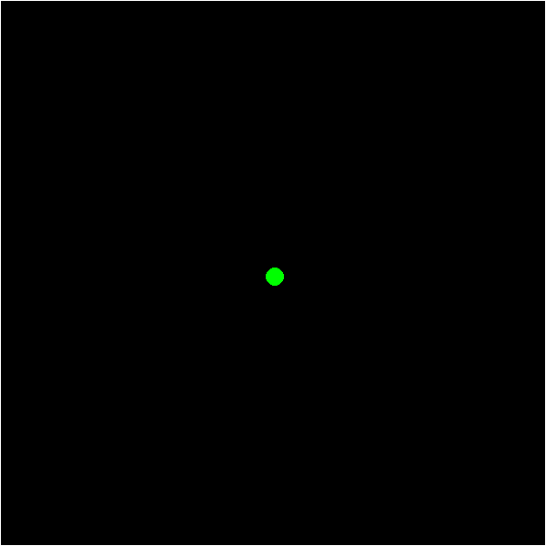

# Brownian Motion Challenge

## Overview
This project simulates the Brownian Motion behavior of a robot within a square arena. The robot, represented as a point, moves randomly, simulating the unpredictable motion characteristic of particles undergoing Brownian Motion.

## Project Structure
```text
Python_Challenge/
├── brownian_motion/ # Module with Brownian motion logic
│   ├── __init__.py
│   └── brownian_sim.py
├── run_brownian.py # Script to run the simulation
└── results/ # Simulation results
    └── brownian_motion.gif
    └── Brownian_motion.gif
```
## How to Run
To run the Brownian Motion simulation, execute the following command in the terminal:
```bash
python run_brownian.py
```

## Demonstration


## Requirements
- Python 3
- Numpy
- Pygame 
